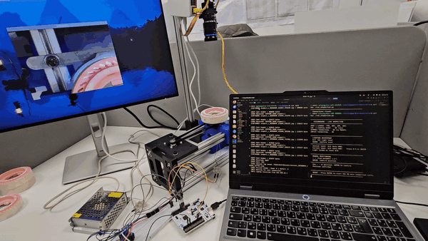
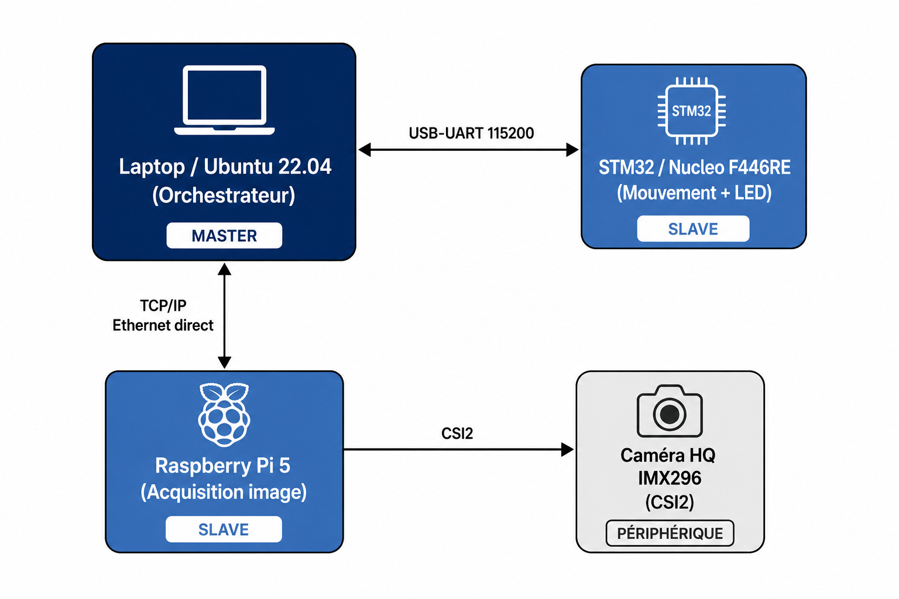
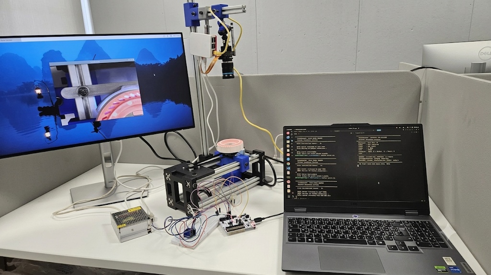

<div align="center">

# VisionGuard

**Automated visual inspection for ceramic aerospace cores**

Detects surface defects (pores and pits ≥ 0.8 mm) across 80 internal vein walls
in one minute per part — mechanics, firmware, acquisition, model and
orchestration built end to end.

`Python` · `C` · `PyTorch` · `OpenCV` · `STM32` · `Raspberry Pi 5` · `SolidWorks`

**Final-year engineering project — ENISo × Pursuit Aerospace Tunisia, 2026**

</div>

---



▶️ [Full demo video](https://github.com/yahyabenturkia/visionguard/releases/download/v1.0/demo.mp4)

---

## Results

| Metric | Value |
|:--|:--|
| Test accuracy | **94.2 %** |
| ROC-AUC | **0.996** |
| Cycle time | **1 min/part** — target was ≤ 3 min |
| Image acquisition | 60 FPS, CSI camera on Raspberry Pi 5 |
| Dataset | 1,312 images, leak-free train/val/test split |
| Model | ResNet18, two-phase transfer learning |

Validated on real production parts under factory lighting conditions.

---

## The problem

Each core carries 80 internal vein walls that must be checked for pores and pits
down to 0.8 mm. Manual inspection is slow, inconsistent between operators, and
the bottleneck on the line. The machine had to fit the existing workflow and
clear a three-minute budget per part.

---

## How it works

**1 · Indexing**
A stepper motor and belt rotate the part so each vein wall faces the camera in
turn. Step angle and speed are computed from the part's vein count. An
STM32 F446RE runs the motion loop as a UART slave to the orchestrator.

**2 · Acquisition**
A Raspberry Pi 5 with a CSI camera captures one frame per vein wall under
controlled lighting, synchronised to the indexing sequence.

**3 · Preprocessing**
ROI detection, CLAHE contrast enhancement, geometric normalisation. The same
code path runs at training and at inference, so there is no train/serve skew.

**4 · Classification**
ResNet18 fine-tuned in two phases — classifier head first, then the full
network at a lower learning rate. Dataset built from scratch and split without
leakage between parts.

**5 · Orchestration**
A Python master on the laptop sequences motion, capture and inference, then
writes a per-part report.



---

## Hardware

The rig was designed in SolidWorks and 3D printed: stepper and belt indexing,
fixed camera mount, controlled lighting enclosure. Motor sizing, step resolution
and lighting geometry were all derived from the part specification.



---

## Repository

```
firmware/        STM32 F446RE motion control (C, HAL)
rpi5/            image acquisition on Raspberry Pi 5
orchestration/   laptop master — sequencing and reporting
ai/              training and inference pipeline
tools/           dataset and calibration utilities
tests/           validation scripts
docs/            diagrams, photos, demo
```

---

## Setup

```bash
git clone https://github.com/yahyabenturkia/visionguard.git
cd visionguard

python -m venv .venv
source .venv/bin/activate
pip install -r requirements.txt
```

Flash the STM32 firmware from `firmware/`, then run the orchestrator:

```bash
python orchestration/run_inspection.py
```

---

## Author

**Yahya Ben Turkia** — Mechatronics engineer, industrial vision and embedded perception

[LinkedIn](https://www.linkedin.com/in/yahya-ben-turkia/) · yahya.benturkiya@gmail.com
